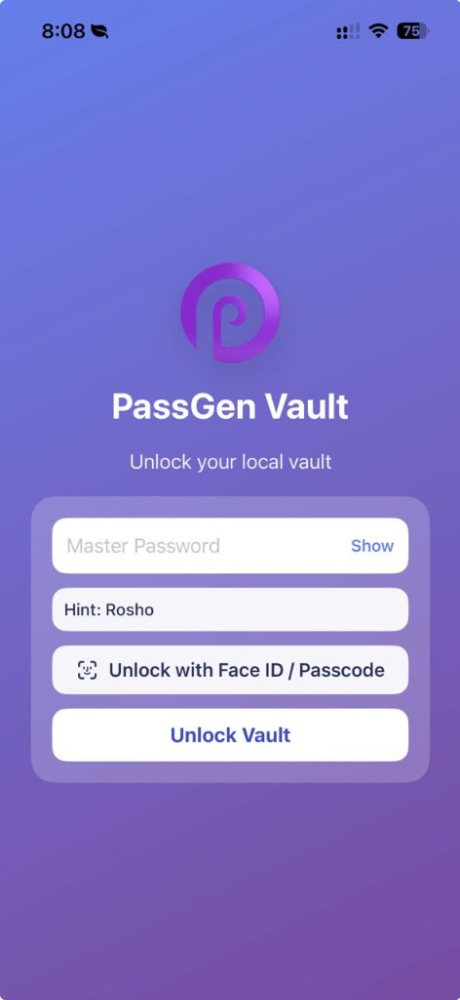
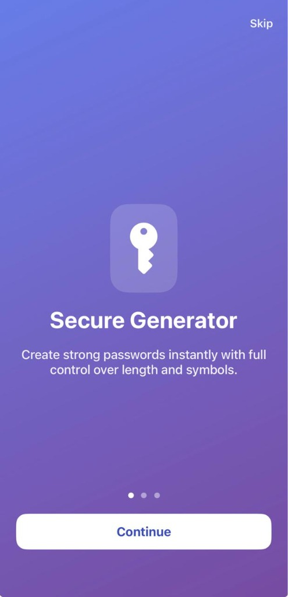
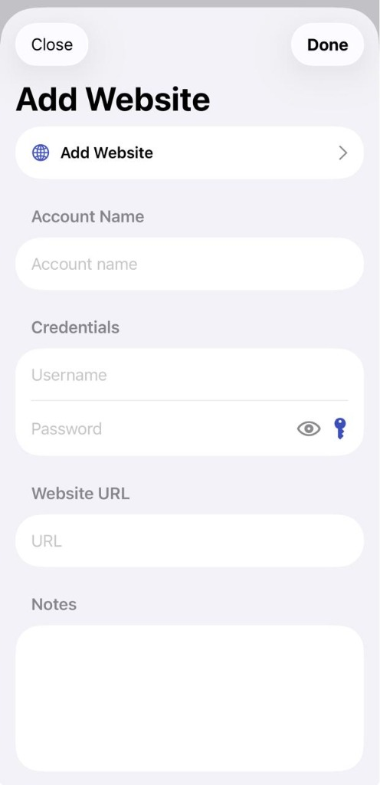
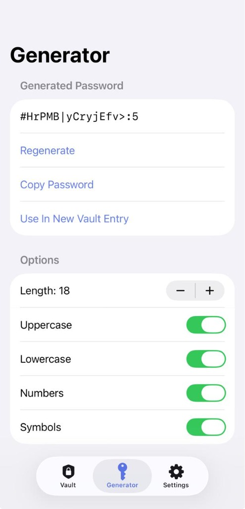
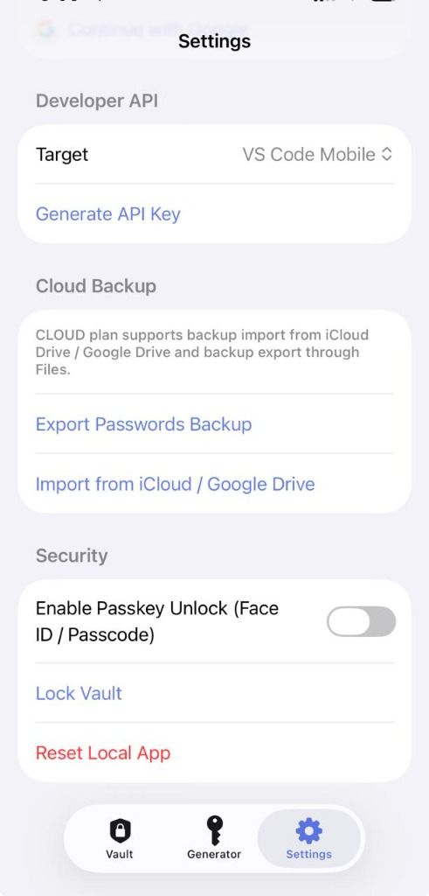
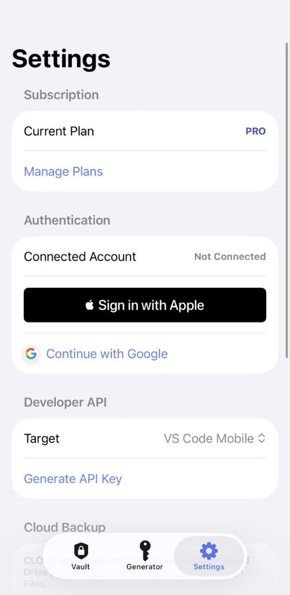
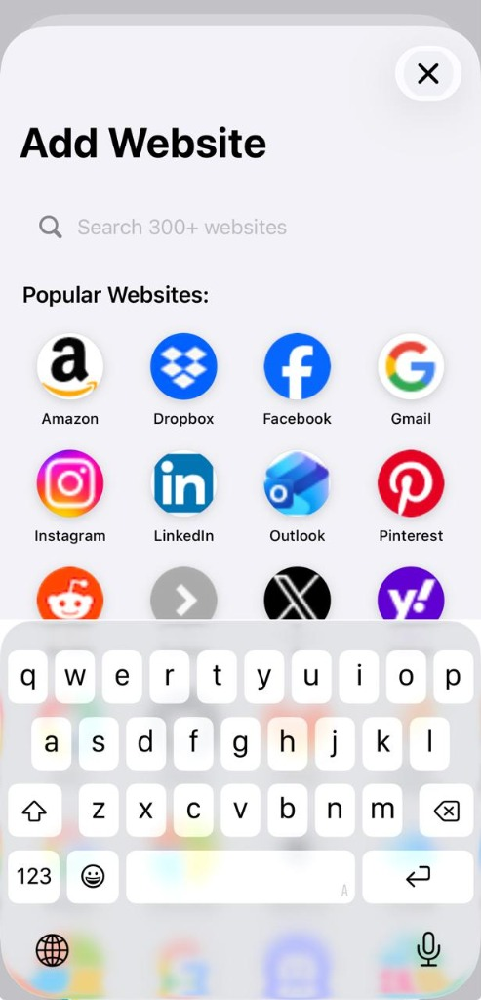

# PassGen Mobile - Secure Password Vault & Generator

  
  
  
  
  
  
  

## What the Project Is About
**PassGen** is a secure password generator and vault application natively bridging to mobile devices. It provides users with the ability to generate secure passwords and store them in an encrypted vault. The application features premium subscription tiers (to unlock unlimited entries and cloud sync) and supports personal vault management securely. 

For the mobile version specifically, the application operates entirely offline-first, using local device storage for the encrypted vault. **For cloud synchronization and database backups across devices, it relies directly on Google Drive (for Android) and iCloud (for iOS)**, instead of an external backend database.

## Platforms & Technology Stack
The project heavily utilizes a modern cross-platform mobile web stack:
- **Ionic Appflow**: Used for Continuous Integration and Continuous Deployment (CI/CD) specifically for automating iOS and Android native builds in the cloud.
- **Capacitor 8**: The native runtime used to bridge the Web application into native iOS and Android apps.
- **React & Vite**: The core frontend framework and bundler powering the web UI.
- **Google Drive APIs & iCloud**: Used as the primary cloud database and synchronization layers for the mobile applications (Android and iOS).
- **Supabase**: The backend-as-a-service providing Authentication (Google, Apple).
- **RevenueCat**: Used to manage mobile In-App Purchases (IAP) and subscriptions across the Apple App Store and Google Play Store.

---

## What We Did (Implementation & Fixes)

### 1. Authentication Integration
- Integrated `@supabase/supabase-js`.
- Implemented **Sign in with Google** and **Sign in with Apple** (which is mandatory for iOS when third-party logins are used).
- Created a custom Authentication Modal in the `PasswordVault` header.
- Transitioned the premium verification status to be bound to the authenticated `user.id` instead of an offline local `installId`.

### 2. Cloud Storage & Synchronization Integrations
- Configured local encrypted storage for the offline-first mobile architecture.
- Integrated **Google Drive API** and **iCloud** as the core database and cloud backup layer for mobile users, replacing the need for an external backend like Supabase on mobile.
- Modified the authentication flows to leverage native Google Sign-In and Apple Sign-In plugins specifically for granting access to users' personal cloud drives.

### 3. Mobile Monetization (In-App Purchases)
- Implemented the core business logic for the app's subscription tiers:
  - **Free Plan**: Hard limit of 4 stored passwords.
  - **PRO Plan ($2.99/mo)**: Unlocks unlimited password entries (offline storage only).
  - **CLOUD Plan ($4.99/mo)**: Unlocks unlimited password entries AND enables cloud synchronization across devices via Google Drive/iCloud.
- Installed and configured `@revenuecat/purchases-capacitor` to manage these subscriptions.
- Successfully fetched the PRO and CLOUD products and displayed them in the `UpgradeModal` based on the user's active entitlement status.

### 4. iOS Build Troubleshooting on Ionic Appflow
We spent significant effort resolving complex CI/CD build failures for iOS on Appflow:
- **The Core Issue**: Capacitor 8 defaults to using Swift Package Manager (SPM). On Appflow, SPM was failing to resolve because Xcode 14+ requires local development teams to be configured for SPM packages, which conflicted with Appflow's automated cloud signing environments.
- **The Solution**: We migrated the iOS build dependency manager from SPM back to **CocoaPods**.
- **Steps Taken**:
  1. Deleted the `CapApp-SPM` directory.
  2. Created a native `ios/App/Podfile` configured to target iOS 15.0 (required by RevenueCat).
  3. Stripped out residual "ghost" SPM references (`XCLocalSwiftPackageReference`) directly from the `App.xcodeproj/project.pbxproj` file to stop Xcode from failing on missing packages.
  4. Fixed a CocoaPods environment variable bug by injecting `#include? "App/Pods/Target Support Files/Pods-App/Pods-App.debug.xcconfig"` into the Capacitor `debug.xcconfig`, which allowed the final Xcode compilation step to find the `Podfile.lock`.
  5. Pushed the correctly tracked `Podfile` to the repository so the Appflow runner could properly execute `pod install`.

---

## 🚫 IMPORTANT REMARKS FOR FUTURE DEVELOPMENT
- **NO MACOS DEVICE**: The developer does not use or possess a macOS device for deployment. All iOS builds MUST be carefully configured and pushed to cloud builders (like Ionic Appflow) because local Xcode testing is impossible.
- **DO NOT** touch, modify, or break any files related to the desktop application.
- **DO NOT** merge or push changes directly to the `main` branch of the desktop app. This repository (`PassGen-Mobile`) is strictly for the mobile adaptations and iOS/Android fixes. The desktop architecture must remain completely isolated and functional.
